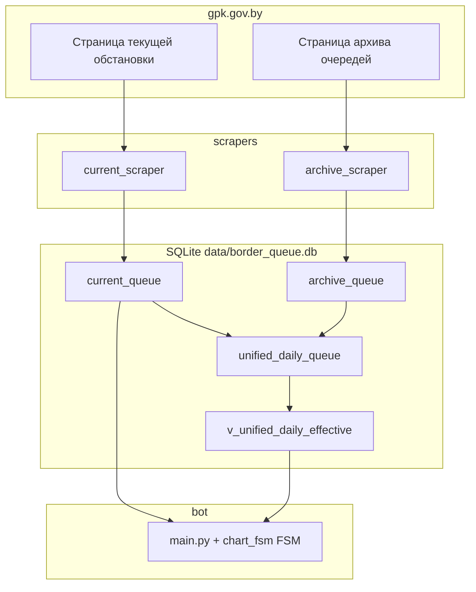

# Belarus Border Queue Tracker

Проект для мониторинга очередей на границе Беларуси по данным с сайта [Госпогкомитет](https://gpk.gov.by/): периодический сбор «текущей обстановки», разовый или повторный сбор архива за выбранное число дней, хранение в SQLite, Telegram-бот с командами и графиками, опциональная ежедневная сводка в чат.

---

## Содержание

1. [Возможности](#возможности)
2. [Как устроен проект](#как-устроен-проект)
3. [Структура репозитория](#структура-репозитория)
4. [Требования](#требования)
5. [Запуск с нуля (полная инструкция)](#запуск-с-нуля-полная-инструкция)
6. [Точки входа и процессы](#точки-входа-и-процессы)
7. [База данных](#база-данных)
8. [Парсеры: как править и отлаживать](#парсеры-как-править-и-отлаживать)
9. [Telegram-бот](#telegram-бот)
10. [Переменные окружения](#переменные-окружения)
11. [Автозапуск в Windows (Task Scheduler)](#автозапуск-в-windows-task-scheduler)
12. [Логи и диагностика](#логи-и-диагностика)
13. [Обслуживание](#обслуживание)
14. [Идеи на будущее](#идеи-на-будущее)

---

## Возможности

| Компонент | Описание |
|-----------|----------|
| Текущий парсер | HTTP-запрос к странице обстановки, разбор HTML, сохранение снимка по списку КПП каждые **2 часа** (`main_scraper.py`). |
| Архивный парсер | Selenium + Chrome: выбор КПП и даты на странице архива, разбор таблицы, сохранение за последние **N дней** (по умолчанию 60). |
| База | SQLite: сырые таблицы + **единая дневная статистика** (архив приоритетнее, иначе данные текущего парсера за этот день). |
| Бот | **Reply-меню** (текущая очередь, мастер графика, 7-дневная история, справка), команды `/queue`, `/history`, `/chart`; **FSM** для пошагового графика; ежедневная сводка в 09:00 (если задан чат). |
| Графики | Данные из `current_queue`: последние N дней, **произвольный диапазон дат**, опционально **фильтр по времени суток** (`HH:MM`); ось времени через `matplotlib.dates`. |

---

## Как устроен проект

Поток данных в общих чертах:



- **`current_queue`** — каждый запуск текущего парсера добавляет строки: значения очередей на момент `timestamp` (несколько точек во времени на одну дату).
- **`archive_queue`** — по одной строке на комбинацию `(КПП, календарная дата, тип транспорта)` с официальными значениями из архива.
- **`unified_daily_queue`** — одна строка на `(checkpoint, day)`; поля `archive_*` и `live_*` заполняются из соответствующих источников; представление **`v_unified_daily_effective`** даёт «эффективные» значения: `COALESCE(archive_*, live_*)` для единой статистики.
- **`db_manager.init_db()`** создаёт таблицы и индексы, при необходимости выполняет миграцию (`PRAGMA user_version`) и бэкфилл unified из уже существующих данных.

---

## Структура репозитория

| Путь | Назначение |
|------|------------|
| `main_scraper.py` | Планировщик: первый сбор сразу, далее каждые 2 часа. |
| `db_manager.py` | Подключение к SQLite, `init_db`, вставки, выборки для бота и unified-слоя. |
| `scrapers/current_scraper.py` | Загрузка и разбор страницы текущей обстановки. |
| `scrapers/archive_scraper.py` | Selenium: архив по дням и КПП. |
| `bot/main.py` | Команды `/start`, `/queue`, `/history`, `/chart`, reply-меню, подключение `chart_router`, `MemoryStorage` для FSM, планировщик daily summary, график топ-3. |
| `bot/chart_fsm.py` | FSM мастера графика, inline-клавиатуры, генерация PNG (`generate_chart_image`), меню «📈 7-Day History», разбор текстовых аргументов `/chart`. |
| `bot/config.py` | Загрузка настроек из переменных окружения. |
| `utils/paths.py` | Корень проекта, путь к БД (`data/border_queue.db`), каталог логов. |
| `utils/logger.py` | Настройка файлового логирования. |
| `data/` | Файл БД (создаётся при первом `init_db`). |
| `logs/` | `scraper.log`, `bot.log` (при использовании `setup_logging`). |
| `scripts/*.bat` | Удобный запуск под Windows из корня репозитория. |
| `requirements.txt` | Зависимости Python. |

---

## Требования

- **ОС:** Windows 10/11 (скрипты ориентированы на `cmd` и `.bat`; код кроссплатформенный, кроме готовых bat).
- **Python:** 3.10+ (как в `setup_venv.bat`: `py -3.10`).
- **Google Chrome** — для архивного парсера (Selenium + webdriver-manager).
- Стабильный **доступ в интернет** к `gpk.gov.by`.

---

## Запуск с нуля (полная инструкция)

### Шаг 1. Клонировать или распаковать проект

Рабочая директория — корень репозитория (где лежат `main_scraper.py`, `requirements.txt`, папка `scripts`).

### Шаг 2. Виртуальное окружение и зависимости

**Вариант A (рекомендуется):** в `cmd` из корня проекта:

```bat
scripts\setup_venv.bat
```

Скрипт создаст `.venv`, обновит `pip`, установит пакеты из `requirements.txt`.

**Вариант B (вручную):**

```bat
py -3.10 -m venv .venv
.venv\Scripts\activate
python -m pip install --upgrade pip
pip install -r requirements.txt
```

### Шаг 3. Инициализация базы данных

```bat
.venv\Scripts\activate
python db_manager.py
```

Создаётся каталог `data` (если его не было) и файл `data\border_queue.db` со всеми таблицами и представлением (см. раздел [База данных](#база-данных)). Повторный запуск **не удаляет** данные, только досоздаёт отсутствующие объекты и при необходимости применяет миграции.

### Шаг 4. Что запускать дальше

| Задача | Команда |
|--------|---------|
| Только сбор текущих очередей (фон, каждые 2 ч) | `scripts\run_scraper.bat` или `python main_scraper.py` |
| Один раз наполнить архив (долго, Chrome) | `scripts\run_archive_once.bat` или `python scrapers\archive_scraper.py` |
| Telegram-бот | Задать `TELEGRAM_BOT_TOKEN`, затем `scripts\run_bot.bat` или `python bot\main.py` |

Типичный сценарий: **сначала** при желании прогнать архивный парсер (или хотя бы часть дней), **параллельно или отдельно** держать запущенным `main_scraper.py` для регулярных снимков. Бот можно запускать на той же машине отдельным процессом.

---

## Точки входа и процессы

| Файл | Роль |
|------|------|
| `main_scraper.py` | `init_db()`, первый `scrape_and_store_current_queue()`, `AsyncIOScheduler` с интервалом 2 часа. |
| `scrapers/archive_scraper.py` | При запуске как скрипт: `init_db()`, `scrape_archive_last_days(...)`. |
| `bot/main.py` | `init_db()`, polling aiogram, `MemoryStorage`, cron daily summary в 09:00 по часовому поясу из конфига. |
| `bot/chart_fsm.py` | Роутер с хендлерами FSM и callback для графика и истории из меню. |
| `db_manager.py` | При `python db_manager.py` — только `init_db()` и сообщение о пути к БД. |

---

## База данных

Файл: `data/border_queue.db` (путь задаётся в `utils/paths.py`).

### Таблица `current_queue`

Сырые снимки текущего парсера.

| Колонка | Смысл |
|---------|--------|
| `id` | Автоинкремент. |
| `checkpoint` | Название КПП (как в списке парсера). |
| `cars_out`, `trucks_out`, `buses_out` | Очереди на выезд по типам. |
| `timestamp` | ISO-время сбора (в парсере обычно округление до минут). |

Индекс: `(checkpoint, timestamp)` — для графиков и последнего снимка.

Выборка для расширенных графиков: **`get_current_queue_range(checkpoint, start_date, end_date, time_from=None, time_to=None)`** в `db_manager.py` — строки за календарный диапазон `[start_date, end_date]` (`YYYY-MM-DD`); при заданных `time_from` / `time_to` (`HH:MM`) дополнительно отбираются точки по времени суток в поле `timestamp` (сравнение подстроки `HH:MM` в ISO-времени, как в скрейпере).

### Таблица `archive_queue`

Сырые строки из архивной страницы (длинный формат).

| Колонка | Смысл |
|---------|--------|
| `checkpoint`, `date` | КПП и дата `YYYY-MM-DD`. |
| `transport_type` | `cars`, `trucks`, `buses`. |
| `queue_length` | Число из таблицы. |
| `scraped_at` | Когда строка была получена парсером. |

Ограничение: `UNIQUE(checkpoint, date, transport_type)` — повторные вставки игнорируются (`INSERT OR IGNORE`).

### Таблица `unified_daily_queue`

Единая **дневная** строка на пару `(checkpoint, day)`:

- **`archive_*`** — последние значения, собранные из `archive_queue` за этот день.
- **`live_*`** — последний снимок за календарный день из `current_queue` (обновляется при каждом текущем сборе).
- Служебные поля: `last_archive_scraped_at`, `last_live_timestamp`, `updated_at`.

### Представление `v_unified_daily_effective`

Столбцы `effective_cars`, `effective_trucks`, `effective_buses` — по сути `COALESCE(archive_*, live_*)`. Именно по ним строится команда **`/history`** (средние за последние N дней).

### Миграции

В `db_manager.py` используется `PRAGMA user_version`. При обновлении кода с более старой схемой выполняется одноразовый бэкфилл unified из уже лежащих в БД `archive_queue` и `current_queue`.

---

## Парсеры: как править и отлаживать

### Текущий парсер — `scrapers/current_scraper.py`

| Что менять | Зачем |
|------------|--------|
| `CURRENT_URL` | Если изменится адрес страницы. |
| `DEFAULT_CHECKPOINTS` | Список КПП на странице и **тот же список** для inline-кнопок в боте (график и 7-дневная история из меню). |
| `fetch_current_page_html()` | Таймауты, число повторов, задержка между попытками. |
| `parse_current_queue()` | Логика поиска блока с текстом по каждому КПП (BeautifulSoup: `select("tr, li, div, ...")`). |
| `_extract_transport_values()` | Регулярки для «легков…», «грузов…», «автобус…» и запасной разбор по числам в блоке. |

Пайплайн вызова: `scrape_and_store_current_queue()` → HTML → `parse_current_queue()` → `insert_current_queue_records()` (и синхронизация unified за этот день).

**Если сайт поменял вёрстку:** откройте страницу в браузере, через DevTools найдите стабильный контейнер с числами, при необходимости сузьте селекторы в `parse_current_queue` или усильте `_extract_transport_values`.

### Архивный парсер — `scrapers/archive_scraper.py`

| Что менять | Зачем |
|------------|--------|
| `ARCHIVE_URL` | URL страницы архива. |
| `CHECKPOINTS` | Список КПП для обхода (желательно согласовать с текущим парсером по названиям). |
| `scrape_archive_last_days(days=60, headless=True)` | Глубина истории и headless-режим браузера. |
| `_build_driver()` | Опции Chrome (окно, headless). |
| `_select_checkpoint()` | Выбор КПП: нативный `<select>` или запасной клик по кастомному dropdown. |
| `_set_date()` | Ввод даты в поле или работа с календарём. |
| `_parse_archive_table()` | Разбор `table`: строки с подстроками «легковые», «грузовые», «автобусы» и извлечение чисел. |

Пайплайн: для каждого КПП и каждого дня — выбор даты, ожидание таблицы, `_parse_archive_table` → три записи в одном «дне» → `insert_archive_records()` (и обновление unified для этой пары КПП+дата).

**Если сломался Selenium:** обновите Chrome; при смене вёрстки правьте селекторы в `_select_checkpoint`, `_set_date`, `_parse_archive_table`.

### Подбор селекторов через DevTools

1. Откройте нужную страницу (текущая или архив).
2. `F12` → инструмент выбора элемента (`Ctrl+Shift+C`).
3. Кликните по блоку с очередью; в дереве DOM найдите устойчивый родитель/строку таблицы.
4. ПКМ → Copy → Copy selector.
5. В консоли страницы проверьте: `document.querySelectorAll("ВАШ_СЕЛЕКТОР").length`.
6. Внесите правки в `current_scraper.py` или `archive_scraper.py`.

---

## Telegram-бот

### Reply-меню и FSM

После **`/start`** под полем ввода отображается постоянная клавиатура:

| Кнопка | Действие |
|--------|----------|
| 🚗 **Current Queue** | То же, что `/queue`: последний снимок по всем КПП. |
| 📊 **Chart** | Запуск **мастера графика** (FSM): выбор КПП (inline) → тип периода («последние N дней» или «свой диапазон») → для N: пресеты 7 / 14 / 30 или ввод числа; для диапазона: одна строка с датами и при необходимости временем (см. ниже). |
| 📈 **7-Day History** | Выбор КПП (inline) → средние за 7 дней из **`v_unified_daily_effective`** (как у `/history`). |
| ❓ **Help** | Текст справки (команды + кнопки), сброс состояния FSM. |

Состояние диалога хранится в **`MemoryStorage`** (RAM процесса бота); при перезапуске бота незавершённый мастер сбрасывается.

### Команды

| Команда | Описание |
|---------|----------|
| `/start` | Справка, сброс FSM, reply-меню. |
| `/queue` | Последний полный снимок по всем КПП из `current_queue` (по максимальному `timestamp`). |
| `/history <КПП>` | Средние за **7 дней** по **единой дневной модели** (`v_unified_daily_effective`: сначала архив за день, иначе live). |
| `/chart` | Без аргументов — то же, что кнопка **📊 Chart** (мастер с выбором КПП и периода). |
| `/chart <КПП> [дни]` | График за последние **N** дней (по умолчанию 7), только `current_queue`. |
| `/chart <КПП> YYYY-MM-DD YYYY-MM-DD` | График за **календарный диапазон** (включительно). |
| `/chart <КПП> YYYY-MM-DD YYYY-MM-DD HH:MM HH:MM` | То же + **фильтр по времени суток** для каждой точки (окно `[time_from, time]` по подстроке времени в `timestamp`). |

Имя КПП в команде — всё между `/chart` и числом дней или датами, **с пробелами** (например, `Каменный Лог`).

Примеры:

```text
/history Брест
/chart Каменный Лог 14
/chart Брест 2026-04-01 2026-04-20
/chart Брест 2026-04-01 2026-04-20 08:00 20:00
```

Графики строятся в памяти (`BytesIO`), на диск не пишутся. Реализация графика и FSM — в **`bot/chart_fsm.py`**; выборки — **`get_current_queue_range`** / агрегаты истории — **`get_archive_average`** в **`db_manager.py`**.

### Ежедневная сводка (09:00)

В `bot/main.py` планировщик `AsyncIOScheduler` отправляет в заданный чат текст топ-3 по легковым и мини-график. Нужны переменные `TARGET_CHAT_ID` (и при форум-группе — `TARGET_MESSAGE_THREAD_ID`).

### Как узнать `chat_id` и `message_thread_id`

1. Добавьте бота в группу/топик.
2. Временно добавьте в `bot/main.py` (или отдельный отладочный роутер) хендлер, который отвечает `chat_id` и `message_thread_id` входящего сообщения.
3. Отправьте сообщение в нужный чат/тему, скопируйте значения в переменные окружения.
4. Удалите отладочный хендлер.

---

## Переменные окружения

Задаются в системе или в сессии `cmd` перед `run_bot.bat` (для скрейпера токен не нужен).

| Переменная | Обязательность | Назначение |
|------------|----------------|------------|
| `TELEGRAM_BOT_TOKEN` | Да, для бота | Токен от @BotFather. |
| `TARGET_CHAT_ID` | Нет | Чат для ежедневной сводки. |
| `TARGET_MESSAGE_THREAD_ID` | Нет | ID темы в супергруппе с темами. |
| `BOT_TIMEZONE` | Нет | IANA-имя зоны, по умолчанию `Europe/Minsk` (см. `bot/config.py`). |

Пример в `cmd`:

```bat
set TELEGRAM_BOT_TOKEN=123456789:YOUR_REAL_TOKEN
set TARGET_CHAT_ID=-1001234567890
set TARGET_MESSAGE_THREAD_ID=42
scripts\run_bot.bat
```

---

## Автозапуск в Windows (Task Scheduler)

Имеет смысл создать **две** задачи: для скрейпера и для бота.

1. **Task Scheduler** → **Create Task…**
2. **General:** имя, например `BorderQueueScraper` / `BorderQueueBot`; при необходимости «Run with highest privileges».
3. **Triggers:** например **At startup** или по расписанию входа пользователя.
4. **Actions** → **New…**
   - Program/script: `cmd.exe`
   - Add arguments (подставьте **свой** путь к репозиторию):

```text
/c "E:\projects\border\scripts\run_scraper.bat"
```

или

```text
/c "E:\projects\border\scripts\run_bot.bat"
```

5. Сохраните и проверьте **Run**.

Для бота в контексте задачи нужно заранее задать переменные окружения пользователя или прописать `set` в отдельном `.bat`-обёртке, который вызывает `run_bot.bat`.

---

## Логи и диагностика

| Лог | Когда |
|-----|--------|
| `logs/scraper.log` | Планировщик текущего парсера (`main_scraper.py` + `setup_logging`). |
| `logs/bot.log` | Бот (`bot/main.py`). |

Типовые проблемы:

- Сайт недоступен — подождать следующего цикла или проверить сеть.
- Пустые или странные значения — сменилась вёрстка; править парсеры (см. выше).
- Пустой график или ответ «No data for this period» — в `current_queue` нет строк для выбранного КПП, диапазона дат или окна по времени; проверьте, что скрейпер пишет данные и имя КПП совпадает с `DEFAULT_CHECKPOINTS`.
- Пустой `/history` — нет строк в unified за выбранные 7 дней (нужен архив и/или текущий сбор).
- Selenium / ChromeDriver — обновить Chrome; при ошибках драйвера перезапустить архивный скрипт.
- Telegram `Unauthorized` — проверить `TELEGRAM_BOT_TOKEN`.

---

## Обслуживание

```bat
python -m compileall .
```

Проверка синтаксиса всех `.py` в дереве.

```bat
python db_manager.py
```

Повторная инициализация схемы без уничтожения пользовательских данных в таблицах.

Резервное копирование: достаточно скопировать файл `data\border_queue.db`.

---

## Идеи на будущее

- PostgreSQL вместо SQLite для нескольких инстансов.
- Расширенная аналитика (скользящие средние, аномалии).
- Docker для Linux/VPS.
- Веб-панель (FastAPI + Plotly).
- Алерты при резком росте очередей.
